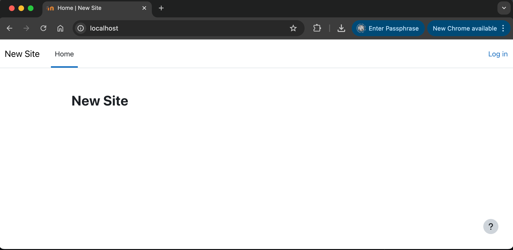
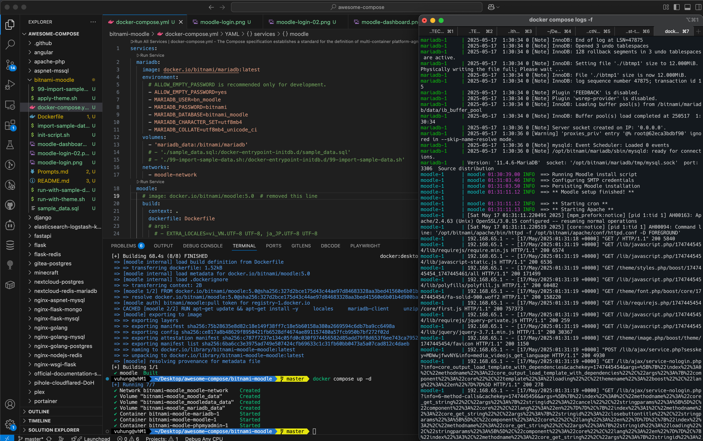

# Bitnami Moodle with Sample Data

This directory contains a Docker Compose setup for Bitnami Moodle with automated sample data loading.

## How to Use

1. Clone this repository.
2. Navigate to the `bitnami-moodle` directory.
3. Install Docker and Docker Compose if not already installed.
4. Run the following command to start the application `docker compose up -d`.
5. Access Moodle at [http://localhost:80](http://localhost:80).
6. Access phpMyAdmin at [http://localhost:8080](http://localhost:8080).
7. Use the provided sample user accounts to log in. (admin) username/password: user/bitnami
8. To stop the application, run `docker compose down`.

## Screenshots

### Moodle Dashboard
 

### Moodle Login


### Moodle in VSCode


## Components

- **Moodle**: Learning Management System
- **MariaDB**: Database for Moodle
- **phpMyAdmin**: Database administration tool

## Sample Data

The setup automatically loads sample data including:

- Users (students, teachers, admin)
- Courses
- Enrollments
- Assignments
- Grades
- Forums
- Posts
- Comments
- Quizzes
- Question bank items

## Quick Start

Run the application with sample data:

```bash
./run-with-sample-data.sh
```

This script will:
1. Stop any existing containers and remove volumes
2. Start the application with Docker Compose
3. Automatically import sample data into the database

## Access Information

- **Moodle**: [http://localhost:80](http://localhost:80)
- **phpMyAdmin**: [http://localhost:8080](http://localhost:8080)

## Login Information

Sample user accounts:

- **Student**: student1 / password
- **Teacher**: teacher1 / password
- **Admin**: admin1 / password

## Data Structure

The sample data includes:
- 6 users (3 students, 2 teachers, 1 admin)
- 4 courses
- Various assignments, forum posts, quizzes, and grades

## Modifying Sample Data

To modify the sample data, edit the `sample_data.sql` file and restart the containers.

## Troubleshooting

If sample data doesn't load:
1. Check the MariaDB logs: `docker-compose logs mariadb`
2. Ensure the initialization scripts have execute permissions
3. Try rebuilding the containers: `docker-compose build --no-cache`
