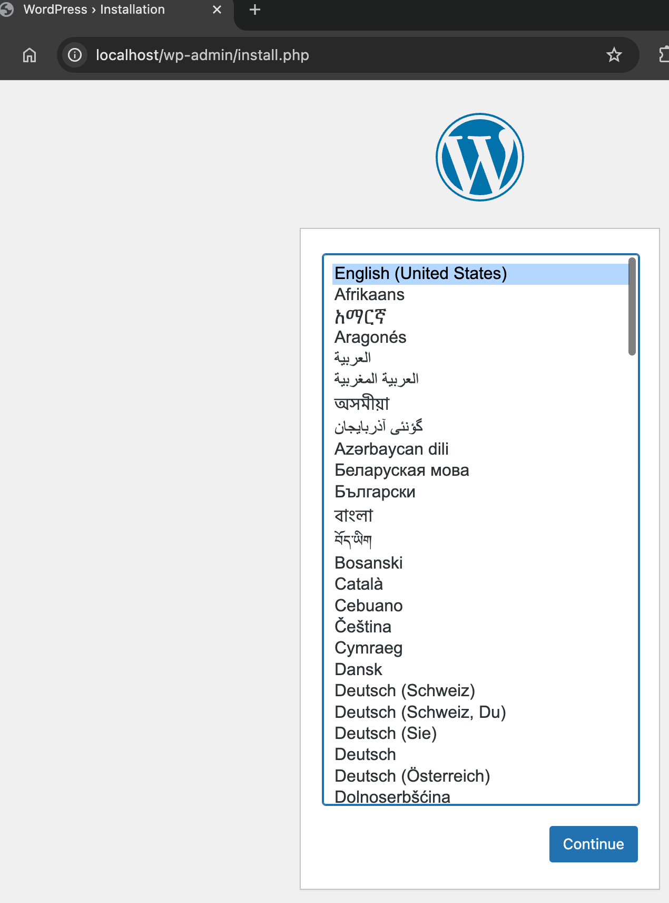

# WordPress with MariaDB

This example defines a basic setup for WordPress with MariaDB as the database. More details on how this works can be found on the official [WordPress image page](https://hub.docker.com/_/wordpress).

Project structure:

```text
.
├── compose.yaml
├── Dockerfile.wordpress
├── Dockerfile.phpmyadmin
├── create-wp-config.sh
├── README.md
└── wordpress-installation.png
```

[_compose.yaml_](compose.yaml)

```yaml
services:
  wordpress:
    build:
      context: .
      dockerfile: Dockerfile.wordpress
    ports:
      - "80:80"
    environment:
      - WORDPRESS_DB_HOST=mariadb
      - WORDPRESS_DB_USER=wordpress
      - WORDPRESS_DB_PASSWORD=wordpress
      - WORDPRESS_DB_NAME=wordpress
    depends_on:
      - mariadb
    networks:
      - wp_network
  mariadb:
    image: mariadb:10.9
    environment:
      - MYSQL_ROOT_PASSWORD=wordpress
      - MYSQL_DATABASE=wordpress
      - MYSQL_USER=wordpress
      - MYSQL_PASSWORD=wordpress
    volumes:
      - db_data:/var/lib/mysql
    networks:
      - wp_network
  phpmyadmin:
    build:
      context: .
      dockerfile: Dockerfile.phpmyadmin
    ports:
      - "8080:80"
    environment:
      - PMA_HOST=mariadb
      - PMA_USER=wordpress
      - PMA_PASSWORD=wordpress
    depends_on:
      - mariadb
    networks:
      - wp_network
volumes:
  db_data:
networks:
  wp_network:
    driver: bridge
```

When deploying this setup, Docker Compose maps the WordPress container port 80 to port 80 of the host as specified in the compose file.

> ℹ️ **_INFO_**
>
> For compatibility between `AMD64` and `ARM64` architecture, MariaDB is used as the database.
> MariaDB 10.9 is compatible with both architectures and works well with WordPress as of 2025.
> Note: WordPress does not natively support PostgreSQL but is fully compatible with MySQL/MariaDB, which is why MariaDB was chosen as the database solution.

## Local Development Configuration

This setup includes:

- **Networks**: A custom bridge network for services to communicate using service names
- **Volumes**: Named volume for MariaDB data persistence
- **Restart Policy**: Automatic restart for all services if they fail
- **phpMyAdmin**: Database administration tool accessible via port 8080
- **Multi-stage builds**: Custom Dockerfiles that significantly reduce image sizes

## Image Size Optimization

To reduce the size of Docker images and improve deployment efficiency, this project uses:

1. **Alpine-based images**: The Alpine Linux distribution is significantly smaller than Ubuntu or Debian-based images.
2. **Specific image tags**: Instead of using `latest`, exact versions are specified.
3. **Multi-stage builds**: Custom Dockerfiles use multi-stage builds to create minimal images with only required components.

### Example image size comparison

| Service    | Original Image                | Size   | Optimized Image              | Size       | Reduction |
|------------|------------------------------|--------|------------------------------|------------|-----------|
| phpMyAdmin | phpmyadmin:latest            | 819MB  | Custom multi-stage build     | 143MB      | ~83%      |

## Before/After Docker Optimization

Here's a comparison of Docker images before and after optimization:

### Before Optimization

```console
TAG                 IMAGE ID       CREATED         SIZE
mariadb      10.9                56710811b0b9   19 months ago   491MB
wordpress    6.4-php8.1-apache   4c64df591c9a   14 months ago   1.03GB
phpmyadmin   latest              68d7f9dc247b   3 months ago    819MB
```

### After Optimization

```console
docker images
REPOSITORY                     TAG       IMAGE ID       CREATED          SIZE
wordpress-mariadb-phpmyadmin   latest    57f51d2fec86   40 minutes ago   143MB
wordpress-mariadb-wordpress    latest    b4a4a62c9eeb   46 minutes ago   284MB
mariadb                        10.9      56710811b0b9   19 months ago    491MB
```

The overall size reduction is 922MB (2,340MB - 1,418MB), which represents approximately a 39% reduction in total image size across all three containers, with significant savings in the WordPress and phpMyAdmin images.

## Deploy Options

### Standard Deployment

```bash
docker compose up -d
```

Example output for standard deployment:

```console
[+] Running 4/4
 ✔ Network wordpress-mariadb_wp_network        Created   0.0s
 ✔ Container wordpress-mariadb-mariadb-1       Started   0.6s
 ✔ Container wordpress-mariadb-wordpress-1     Started   0.3s
 ✔ Container wordpress-mariadb-phpmyadmin-1    Started   0.3s
```

## Expected result

Check containers are running and the port mapping:

```bash
docker ps
```

Example output:

```console
CONTAINER ID   IMAGE                         COMMAND                  CREATED          STATUS          PORTS                NAMES
d4feb59bab20   wordpress-mariadb-wordpress   ...                     Up 46 seconds   0.0.0.0:80->80/tcp   wordpress-mariadb-wordpress-1
0ff2639f74ca   mariadb:10.9                  ...                     Up 46 seconds   3306/tcp             wordpress-mariadb-mariadb-1
```

## Accessing Services

### WordPress

Navigate to `http://localhost:80` in your web browser to access WordPress.



### phpMyAdmin

Navigate to `http://localhost:8080` to access phpMyAdmin:

- **Server**: mariadb
- **Username**: wordpress
- **Password**: wordpress

phpMyAdmin provides a web interface for:

- Managing database tables and records
- Importing and exporting data
- Running SQL queries
- Monitoring database performance

### Stopping Services

```bash
docker compose down
```

To remove all WordPress data, delete the named volumes by passing the `-v` parameter:

```bash
docker compose down -v
```

## Configuration Optimizations

To ensure the Docker containers work properly, several configuration improvements were made:

### WordPress Configuration

- Fixed entrypoint script in `Dockerfile.wordpress` with proper newline handling using `echo -e`
- Optimized Apache and PHP-FPM configuration for better performance
- Used Alpine as base image to reduce overall size

### phpMyAdmin Configuration

- Added proper PHP-FPM user/group settings (`user = nginx` and `group = nginx`)
- Improved configuration files with proper newlines using `echo -e`
- Used Alpine as the base image

### MariaDB Configuration

- Used official MariaDB image for compatibility
- Ensured proper volume setup for data persistence

## Troubleshooting

### Common Issues

#### Database Connection Error

If WordPress cannot connect to the database:

1. Check that the MariaDB container is running
2. Verify the environment variables in both containers match
3. Try restarting both services

#### phpMyAdmin Connection Issues

If you cannot access phpMyAdmin or it cannot connect to MariaDB:

1. Ensure the `mariadb` service is running
2. Check that port 8080 is not being used by another application
3. Verify the environment variables match those used by MariaDB

#### Persistence Issues

If your data disappears after restarts:

1. Make sure you're not using `down -v` which removes volumes
2. Check that volumes are properly configured in your compose file

## Additional Information

### Security Note

The configuration provided is intended for local development only. For production environments:

- Use strong, unique passwords
- Consider using Docker secrets for sensitive information
- Implement proper network segmentation
- Enable SSL/TLS for secure connections

### Extending the Setup

This basic setup can be extended with additional services:

- Redis for caching
- NGINX as a reverse proxy
- MailHog for email testing

### License

This project is distributed under the MIT License. See the [LICENSE](LICENSE) file for details.
